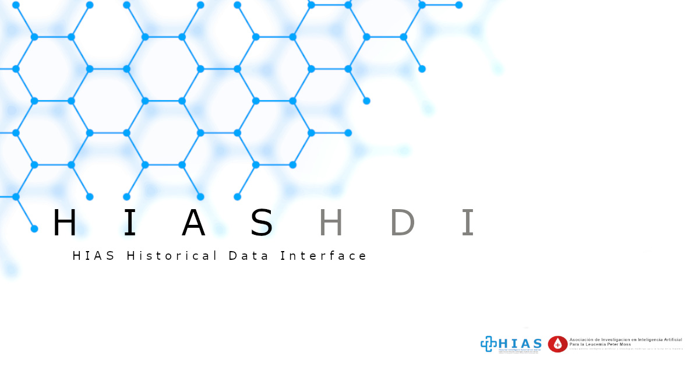

# Asociación de Investigacion en Inteligencia Artificial Para la Leucemia Peter Moss
# HIASHDI - HIAS Historical Data Interface

    

  

&nbsp;

# Table Of Contents

- [Introduction](#introduction)
- [HIAS](#hias)
- [GETTING STARTED](#getting-started)
- [Contributing](#contributing)
  - [Contributors](#contributors)
- [Versioning](#versioning)
- [License](#license)
- [Bugs/Issues](#bugs-issues)

&nbsp;

# Introduction

**HIASHDI** is the **Hospital Intelligent Automation Server Histrocial Data Interface**. HIASHDI (HIAS Historical Data Interface) is an implementation of a REST API Server that stores HIAS network historical data and serves it to authenticated HIAS devices & applications by exposing the data through a REST API and pushing data through subscriptions.

&nbsp;

# HIAS

[HIAS - Hospital Intelligent Automation Server](https://github.com/AIIAL/HIAS-Server) is an open-source automation server designed to control and manage an intelligent network of IoT connected devices and applications.

HIAS devices and applications are the **historical data producers** for the HIAS network. These devices and applications publish data to the historical broker using supported machine to machine communication protocols and the REST API.

HIAS devices and applications are also the **historical data consumers**. Devices and applications connected to the network consume historical data generated by the network.

&nbsp;

# GETTING STARTED

Ready to get started ? Head over to the [Getting Started guide](docs/index.md) for instructions on how to download/install and setup the HIAS Historical Data Interface.

&nbsp;

# Contributing
Asociación de Investigacion en Inteligencia Artificial Para la Leucemia Peter Moss encourages and welcomes code contributions, bug fixes and enhancements from the Github community.

Please read the [CONTRIBUTING](CONTRIBUTING.md "CONTRIBUTING") document for a full guide to forking our repositories and submitting your pull requests. You will also find information about our code of conduct on this page.

## Contributors
- [Adam Milton-Barker](https://www.leukemiaairesearch.com/association/volunteers/adam-milton-barker "Adam Milton-Barker") - [Asociación de Investigacion en Inteligencia Artificial Para la Leucemia Peter Moss](https://www.leukemiaresearchassociation.ai "Asociación de Investigacion en Inteligencia Artificial Para la Leucemia Peter Moss") President/Founder & Lead Developer, Sabadell, Spain

&nbsp;

# Versioning
We use SemVer for versioning.

&nbsp;

# License
This project is licensed under the **MIT License** - see the [LICENSE](LICENSE "LICENSE") file for details.

&nbsp;

# Bugs/Issues
We use the [repo issues](issues "repo issues") to track bugs and general requests related to using this project. See [CONTRIBUTING](CONTRIBUTING.md "CONTRIBUTING") for more info on how to submit bugs, feature requests and proposals.
