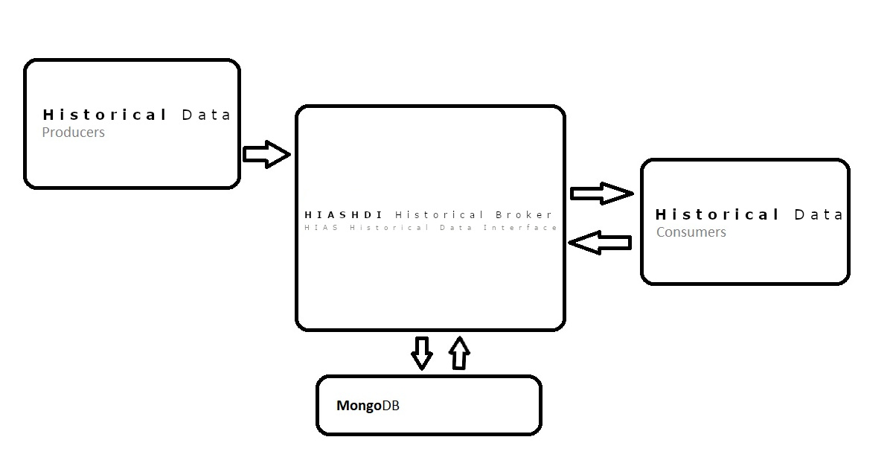

# Documentation

&nbsp;

# Introduction

**HIASHDI** is the **Hospital Intelligent Automation Server Histrocial Data Interface**. HIASHDI (HIAS Historical Data Interface) is an implementation of a REST API Server that stores HIAS network historical data and serves it to authenticated HIAS devices & applications by exposing the data through a REST API and pushing data through subscriptions.

&nbsp;

# Installation

Head over to the [Ubuntu Installation Guide](installation/ubuntu.md) for a complete installation guide.

&nbsp;

# Usage

Head over to the [API Usage Guide](usage/api.md) for a complete installation guide to the HIASHDI API.

&nbsp;

# Contributing
Asociación de Investigacion en Inteligencia Artificial Para la Leucemia Peter Moss encourages and welcomes code contributions, bug fixes and enhancements from the Github community.

## Ways to contribute

The following are ways that you can contribute to this project:

- [Bug Report](https://github.com/AIIAL/HIASHDI/issues/new?assignees=&labels=&template=bug_report.md&title=)
- [Feature Request](https://github.com/AIIAL/HIASHDI/issues/new?assignees=&labels=&template=feature_request.md&title=)
- [Feature Proposal](https://github.com/AIIAL/HIASHDI/issues/new?assignees=&labels=&template=feature-proposal.md&title=)
- [Report Vulnerabillity](https://github.com/AIIAL/HIASHDI/issues/new?assignees=&labels=&template=report-a-vulnerability.md&title=)

Please read the [CONTRIBUTING](https://github.com/AIIAL/HIASHDI/blob/main/CONTRIBUTING.md "CONTRIBUTING") document for a contribution guide.

You can also join in with, or create, a discussion in our [Github Discussions](https://github.com/AIIAL/HIASCDI/discussions) area.

## Contributors

All contributors to this project are listed below.

- [Adam Milton-Barker](https://www.leukemiaairesearch.com/association/volunteers/adam-milton-barker "Adam Milton-Barker") - [Asociación de Investigacion en Inteligencia Artificial Para la Leucemia Peter Moss](https://www.leukemiaresearchassociation.ai "Asociación de Investigacion en Inteligencia Artificial Para la Leucemia Peter Moss") President/Founder & Lead Developer, Sabadell, Spain

&nbsp;

# Versioning
We use [SemVer](https://semver.org/) for versioning.

&nbsp;

# License
This project is licensed under the **MIT License** - see the [LICENSE](https://github.com/AIIAL/HIASHDI/blob/main/LICENSE "LICENSE") file for details.

&nbsp;

# Bugs/Issues

You use the [repo issues](https://github.com/AIIAL/HIASHDI/issues/new/choose "repo issues") to track bugs and general requests related to using this project. See [CONTRIBUTING](https://github.com/AIIAL/HIASHDI/blob/main/CONTRIBUTING.md "CONTRIBUTING") for more info on how to submit bugs, feature requests and proposals.